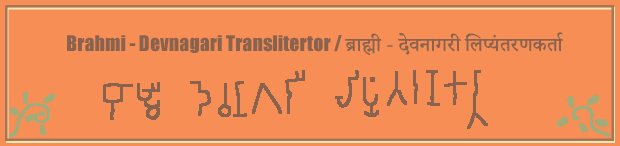

## About
"Brahmi-Devnagari Transliterator" project is dedicated to provide an easy convinient way to convert the text written in Devnagari lipi (script) to [Brahmi](https://en.wikipedia.org/wiki/Brahmi_script) ([Ashokan Brahmi](https://en.wikipedia.org/wiki/Brahmi_script#Early_Brahmi_or_%22Ashokan_Brahmi%22_(3rd%E2%80%931st_century_BCE)) to be precise) script. 

Eventually planning a way to convert the text into equivalent [IAST](https://en.wikipedia.org/wiki/International_Alphabet_of_Sanskrit_Transliteration).

